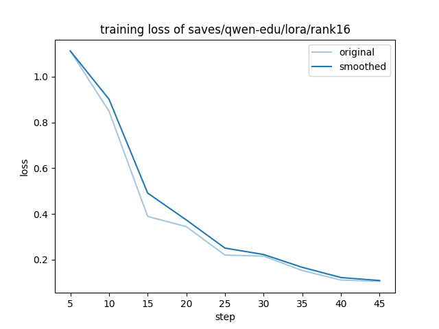
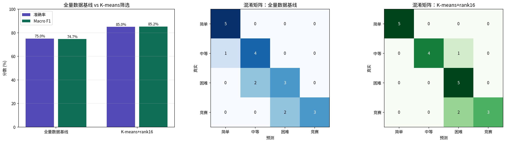

# 题目难度智能分类系统

基于 [LLaMA-Factory](https://github.com/hiyouga/LLaMA-Factory) 二次开发，遵循 Apache License 2.0

## 项目简介

在 LLaMA-Factory SFT 流程前新增 K-means 语义聚类数据筛选模块，结合 QLoRA 微调实现教育题目四级难度自动分类（简单 / 中等 / 困难 / 竞赛），支持数学、语文、英语等 6 大科目。

## 核心结果

| 配置 | 准确率 | Macro F1 |
|------|--------|---------|
| 全量数据基线（152条） | 75.0% | 74.7% |
| K-means筛选+QLoRA（76条） | **85.0%** | **85.2%** |

K-means 筛选后用一半数据，准确率提升 10%，验证了小样本场景下数据多样性比数据量更关键。

## 技术亮点

- **K-means 数据筛选**：sentence-transformers 生成 384 维语义向量，K=20 聚类后每簇取 5 条代表样本，152 条压缩至 78 条
- **QLoRA 微调**：NF4 4-bit 量化 + LoRA rank=16，可训练参数仅占全部参数 1.75%
- **消融实验**：对比 rank=4/8/16/20，确定最优配置
- **Gradio 演示**：支持 6 科目 4 档难度实时预测

## 文件说明

| 文件 | 说明 | 运行环境 |
|------|------|---------|
| step1_generate_data.py | 调用阿里云百炼API生成训练数据 | 本地 |
| step2_kmeans_filter.py | K-means语义聚类数据筛选 | 本地 |
| step3_train_colab.ipynb | QLoRA微调训练 + 真实模型评测 | Google Colab |
| step4_gradio_demo.py | Gradio可视化演示界面 | 本地 |

## 运行流程

```bash
# 安装依赖
pip install -r requirements_local.txt

# Step 1：生成训练数据（填入阿里云百炼 API Key）
python step1_generate_data.py

# Step 2：K-means 数据筛选
python step2_kmeans_filter.py

# Step 3：上传 step3_train_colab.ipynb 到 Google Colab 训练

# Step 4：启动演示界面
python step4_gradio_demo.py
```

## 技术栈

Python · LLaMA-Factory · QLoRA · Qwen2.5-0.5B · K-means · sentence-transformers · Gradio · 阿里云百炼 API

## 效果展示

### 训练曲线


### 评测对比

